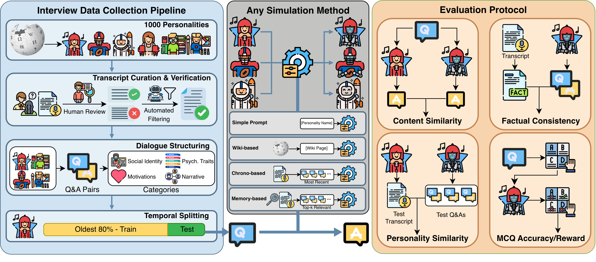

# InterviewSim: A Scalable Framework for Interview-Grounded Personality Simulation

Paper: https://arxiv.org/abs/2602.20294

**InterviewSim** is a framework for comparing how language models generate
responses from different forms of interview grounding. It treats simulation
as a held-out evaluation problem: methods receive earlier context, answer
questions from later interviews, and are assessed along complementary
dimensions rather than by fluency alone.

## Research use

> This release is for research purposes only and should not be used to compete with OpenAI, Anthropic, or Google.

This release supports research analysis and comparison of synthetically
generated interview-response datasets and their evaluation results. The
bundled examples are entirely fictional; real interview data are not
distributed with this repository.

## Framework overview



## Contributions

1. A temporal holdout design for comparing profile, chronological, retrieval,
   and hybrid grounding under the same questions.
2. A multi-dimensional protocol for content similarity, factual consistency,
   personality alignment, and factual knowledge retention.
3. Paired analysis that exposes method trade-offs hidden by any single metric.

## Experimental setup

Interview records are ordered temporally for each personality. The oldest 80%
supply generation context, while the newest 20% are held out for evaluation.
All question-and-response pairs from an interview remain in the same
partition.

Response generation uses GPT-4.1 throughout the paper. The main comparison
evaluates eight configurations:

- **Parametric and profile baselines:** Simple, Wiki, and Wiki-Long.
- **Chronological grounding:** Chrono-100, Chrono-500, and Chrono-1000 use 100,
  500, or 1,000 training Q&A pairs in chronological order.
- **Retrieval grounding:** Memory-100 retrieves the 100 most relevant training
  Q&A pairs using `text-embedding-3-small`.
- **Hybrid grounding:** Hybrid-100 combines 50 retrieved pairs with 50 recent
  chronological pairs, resolving duplicates in favor of retrieval order.

A retrieval ablation additionally compares 10, 50, and 100 relevant examples
with a 100-example random-selection control. Judge-based metrics use GPT-4o,
Claude Sonnet 4.6, and Gemini 3.1 Pro independently. Method comparisons use
two-sided paired sign-flip permutation tests with 10,000 permutations at the
personality level.

## Four evaluation metrics

- **Content Similarity (CS, ↑):** an LLM judge compares a generated response
  with the held-out response on a 1–5 semantic-similarity scale.
- **Factual Consistency (reported as Contradiction Ratio, CR, ↓):** an LLM
  judge labels each response as Entailment, Neutral, or Contradiction against
  an evaluation-only fact summary.
- **Personality Similarity (PS, ↑):** independent Big Five trait ratings for
  held-out and generated response collections are compared by ordinal
  alignment.
- **Factual knowledge retention (MCQ, ↑):** exact-match accuracy and a
  severity-aware reward evaluate questions built from held-out interview
  facts; MCQ scoring is judge-independent.

CS, CR, and PS are reported separately for **GPT-4o, Claude Sonnet 4.6, and
Gemini 3.1 Pro**, in that order, because judge calibration differs.

## Key findings

Values below are macro-averaged results from the main comparison. Judge
triples follow **GPT-4o / Claude Sonnet 4.6 / Gemini 3.1 Pro** order.

- **Interview grounding improves content alignment and factual recall** over
  profile-only and parametric baselines.
- **Hybrid-100 leads Content Similarity** under GPT-4o (**3.54**) and Gemini
  (**2.97**); **Chrono-1000** leads under Claude (**2.62**).
- **Retrieval tends to preserve personality alignment.** Memory-100 achieves
  the best PS results: **78.4 / 75.6 / 84.0**; Hybrid-100 ties it under Gemini
  at **84.0**.
- **Larger chronological contexts generally reduce contradictions and improve
  factual recall.** Chrono-1000 has the lowest CR under Claude (**12.44%**) and
  Gemini (**10.43%**) and the highest MCQ accuracy (**89.3%**).
- Under GPT-4o, Wiki-Long has the numerically lowest CR (**5.67%**), but is
  statistically tied with Hybrid and every chronological variant.

These findings are method- and judge-dependent; the framework therefore keeps
the evaluation dimensions separate rather than collapsing them into one
score.

## Code capabilities

This repository implements the inspectable, post-preparation portion of
InterviewSim. It accepts locally prepared interview records and
caller-supplied model and embedding functions. It supports method inspection
and experiments on conforming inputs, but is not a turnkey reproduction of the
paper's reported results, which depend on additional inputs and model
configurations.

The package provides:

- strict loading and validation of `prepared_input.json`;
- interview-level temporal splitting with no Q&A leakage across partitions;
- no-context, short-profile, long-profile, chronological, random, retrieval,
  and hybrid prompt builders;
- prompt contracts, parsers, and aggregation for CS, CR, and PS;
- atomic-item and 3- or 4-option MCQ construction and exact scoring; and
- paired sign-flip permutation tests at the personality level.

Generated responses are experimental outputs, not verified statements.

## Installation

InterviewSim requires Python 3.10 or newer and has no required runtime
dependencies:

```bash
python -m pip install .
```

For development:

```bash
python -m pip install -e ".[dev]"
python -m pytest
python -m ruff check .
```

## Quickstart

Run the deterministic, offline demonstration against one fictional prepared
input:

```bash
python -m pip install -e .
python - <<'PY'
import json

from interviewsim import run_synthetic_demo

path = "examples/synthetic_examples/personalities/PERSONALITY_001/prepared_input.json"
print(json.dumps(run_synthetic_demo(path), indent=2))
PY
```

The demonstration makes no network calls. It exercises schema loading, all
seven public generation strategies, the four metric families, both MCQ
formats, and paired statistics.

## Input format

The canonical loader input is one UTF-8 `prepared_input.json` document per
`personality_id`. Each document contains short and long profiles plus ordered
interview records with question-and-response pairs. The latest 20% of complete
interview records, rounded up, form the held-out partition; at least one
interview must remain on each side.

See the [complete input schema](docs/INPUT_SCHEMA.md) for required fields,
strict validation rules, and an abstract example.

## Synthetic examples

The [synthetic examples](examples/synthetic_examples) were authored entirely
from scratch for this repository from ten generic fictional roles, with five
short interviews per role. They were never sampled from or transformed from
the research transcripts. Split and reference artifacts were generated
deterministically for format inspection and offline checks.

## Documentation

- [Input schema](docs/INPUT_SCHEMA.md)
- [Public prompt contracts](docs/PROMPTS.md)
- [Release scope](docs/RELEASE_BOUNDARY.md)
- [Ethical considerations](docs/ETHICAL_CONSIDERATIONS.md)
- [Contributing](CONTRIBUTING.md)
- [Code of Conduct](CODE_OF_CONDUCT.md)
- [Security policy](SECURITY.md)

## Ethics

Read the full [ethical considerations](docs/ETHICAL_CONSIDERATIONS.md) before
using the framework. Generated text should be clearly labeled, kept separate
from source records, and never presented as a quotation or verified statement.

> This release is for research purposes only in support of an academic paper. Our models, datasets, and code are not specifically designed or evaluated for all downstream purposes. We strongly recommend users evaluate and address potential concerns related to accuracy, safety, and fairness before deploying this model. We encourage users to consider the common limitations of AI, comply with applicable laws, and leverage best practices when selecting use cases, particularly for high-risk scenarios where errors or misuse could significantly impact people's lives, rights, or safety. For further guidance on use cases, refer to our AUP and AI AUP.

## License

Copyright (c) 2026 Salesforce, Inc. Licensed under the
[Creative Commons Attribution-NonCommercial 4.0 International License
(CC-BY-NC 4.0)](LICENSE.txt).
